Chart Examples
==============

Column Chart
------------

Create a simple column chart::

   ...
   # Create a chart object.
   chart = workbook.add_chart({'type': 'column'})

   # Configure the series of the chart from the dataframe data.
   chart.add_series({
      'values':     '=Sheet1!$B$2:$B$8',
      'gap':        2,
   })

   # Configure the chart axes.
   chart.set_y_axis({'major_gridlines': {'visible': False}})

   # Turn off chart legend. It is on by default in Excel.
   chart.set_legend({'position': 'none'})
   ...

:ref:`Full example code <chart_column>`.

The output from this program exported from Excel as an image is:

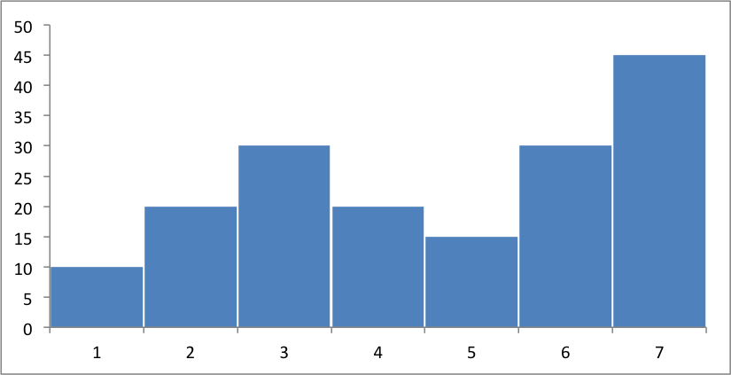

Instead of the Excel style range notation, you can use the following list
syntax which is easier to create programmatically::

   chart.add_series({
       'values':     ['=Sheet1', 1, 1, 7, 1],
       'gap':        2,
   })

Excel refers to this type of histogram chart as "Column" charts.

Axis Labels
-----------

Adding labels to the chart axes is easy::

   chart.set_x_axis({'name': 'Index'})
   chart.set_y_axis({'name': 'Value', 'major_gridlines': {'visible': False}})

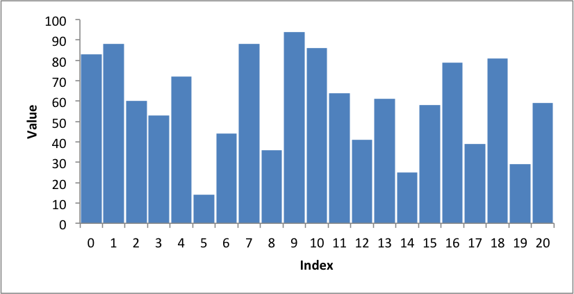

:ref:`Full example code <chart_axis_labels>`.

You can also rotate the axis numbers::

   chart.set_x_axis({'name': 'Index', 'num_font':  {'rotation': 45}})

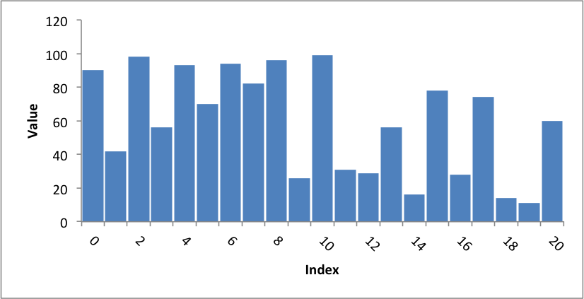

:ref:`Full example code <chart_axis_labels_rotated>`.

Line Chart
----------

Create a simple Line chart::

   chart = workbook.add_chart({'type': 'line'})

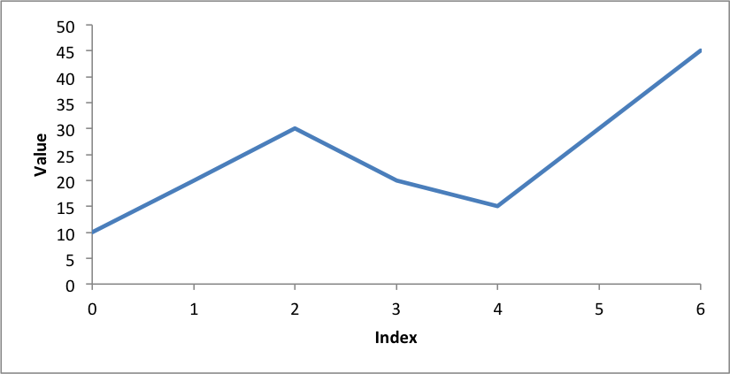

:ref:`Full example code <chart_line>`.

Legends
-------

Excel adds a legend to a chart by default:

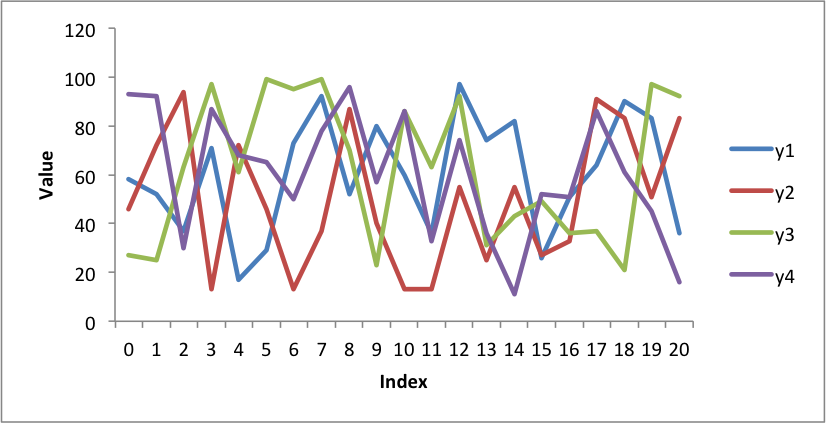

:ref:`Full example code <chart_legend>`.

We can also turn the chart legend off, like the previous examples, or position
the legend.

The following is an example using stock data and positioning the legend at the
top of the chart::

   chart.set_legend({'position': 'top'})

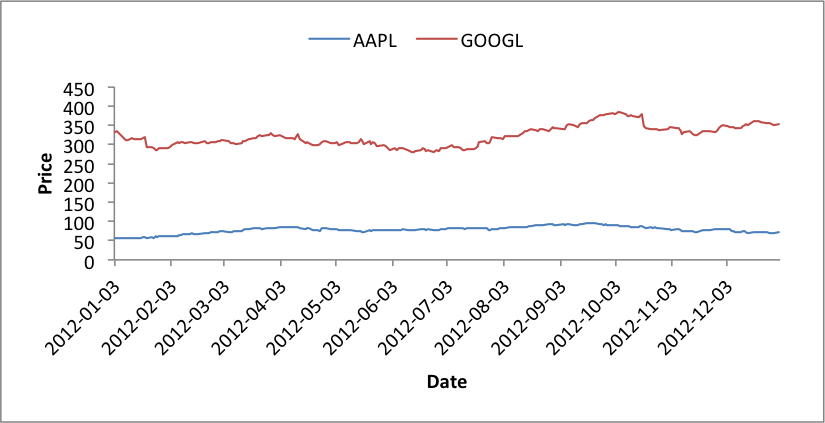

:ref:`Full example code <chart_legend_stock>`.

Scatter Chart
-------------

Create a simple scatter chart.

Rather than use Excel's default symbols for each data series we set each one to
be a circle::

   chart.add_series({
     # ...
     'marker':     {'type': 'circle', 'size': 7},
   })

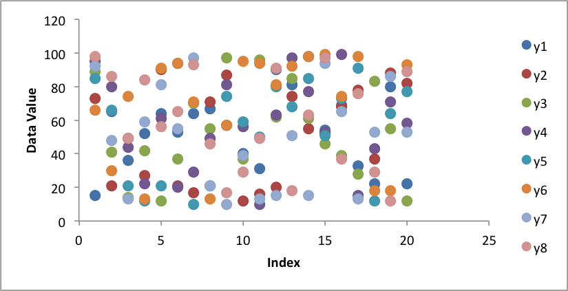

:ref:`Full example code <chart_scatter>`.

Colours
-------

Colours are configurable for almost all aspects of XlsxWriter charts. In the
following example we borrow the `Color Brewer <http://colorbrewer2.org/>`_
colours from Vincent and apply them to a scatter chart:

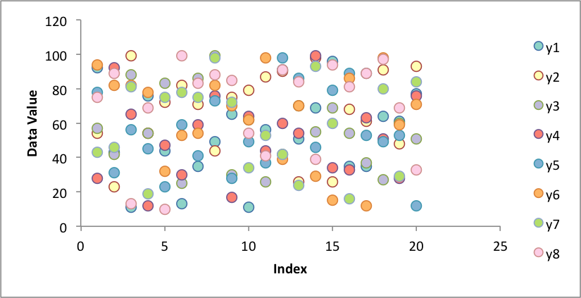

:ref:`Full example code <chart_colors>`.

Area Chart
----------

Create a simple Area chart::

   chart = workbook.add_chart({'type': 'area'})

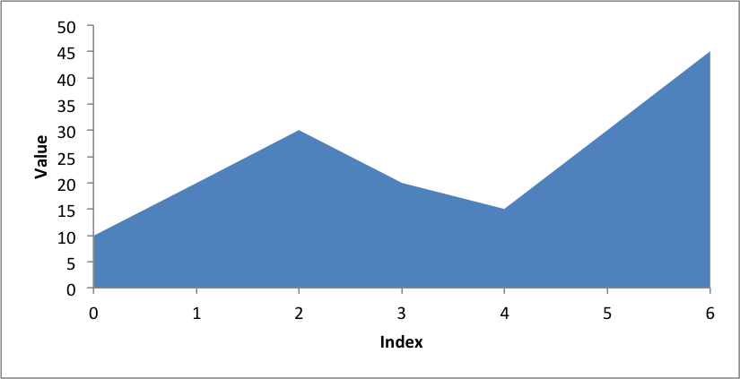

:ref:`Full example code <chart_area>`.

Stacked Area Chart
------------------

A Stacked Area chart is a subtype of an Area chart in Excel::

   chart = workbook.add_chart({'type': 'area', 'subtype': 'stacked'})

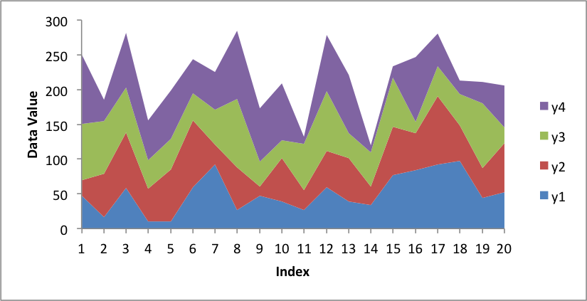

:ref:`Full example code <chart_stacked_area1>`.

Or with more categories and the 'Spectral' colorbrew scheme from Vincent:

.. image:: _images/chart_stacked_area2.png

:ref:`Full example code <chart_stacked_area2>`.

Or with stock data and the 'Accent' colorbrew scheme:

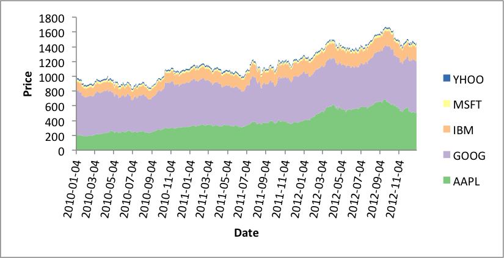

:ref:`Full example code <chart_stacked_area3>`.

Stacked Column Chart
--------------------

A Stacked Column chart is a subtype of an Column chart in Excel::

   chart = workbook.add_chart({'type': 'column', 'subtype': 'stacked'})

.. image:: _images/chart_stacked_column.png

:ref:`Full example code <chart_stacked_column>`.

Or with different data and a wider gap:

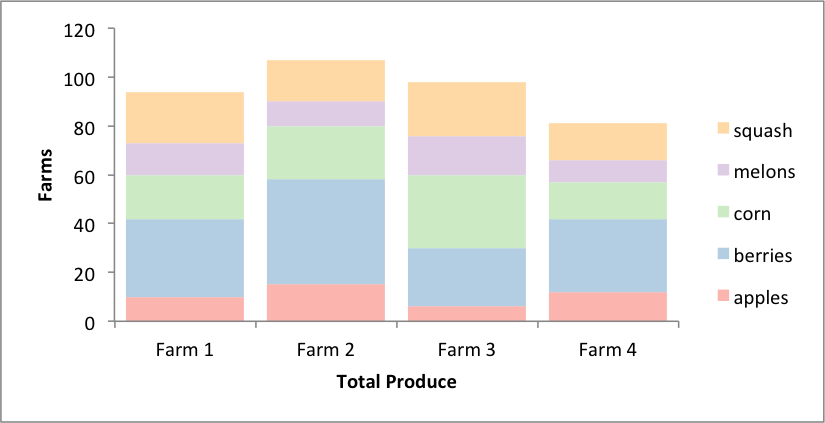

:ref:`Full example code <chart_stacked_column_farms>`.

Grouped Column Chart
--------------------

A Grouped Column chart is the default Column chart in Excel::

   chart = workbook.add_chart({'type': 'column'})

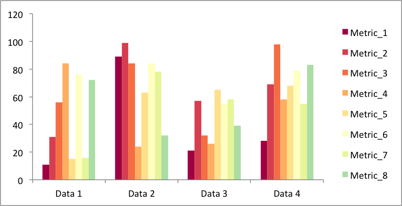

:ref:`Full example code <chart_grouped_column>`.

Or with the farm data from above:

:ref:`Full example code <chart_grouped_column_farms>`.

Chart Images
------------

The images shown above were all exported from Excel for Mac 2011 using files
created with Pandas and XlsxWriter.

The
`example programs <https://github.com/jmcnamara/pandas_xlsxwriter_charts/tree/master/examples>`_
and
`output files <https://github.com/jmcnamara/pandas_xlsxwriter_charts/tree/master/examples/output_files>`_
are on GitHub.

