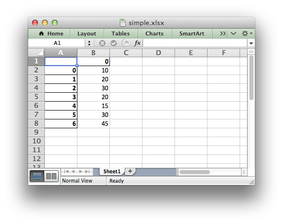

Pandas and XlsxWriter
=====================

The following is a simple example of creating a
`Pandas <http://pandas.pydata.org/>`_ dataframe and using the ``to_excel()``
method to write that data out to an Excel file::

   import pandas as pd

   # Create a Pandas dataframe from the data.
   df = pd.DataFrame([10, 20, 30, 20, 15, 30, 45])

   # Create a Pandas Excel writer using XlsxWriter as the engine.
   writer = pd.ExcelWriter('simple.xlsx', engine='xlsxwriter')
   df.to_excel(writer, sheet_name='Sheet1')

   # Close the Pandas Excel writer and output the Excel file.
   writer.save()

The output from this would look like the following:

The option of adding an alternative writer ``engine`` is only available in
Pandas version 0.13 and later.

In order to add a chart to the worksheet we first need to get access to the
underlying XlsxWriter
`Workbook <https://xlsxwriter.readthedocs.org/en/latest/workbook.html>`_ and
`Worksheet <https://xlsxwriter.readthedocs.org/en/latest/worksheet.html>`_
objects.

Continuing on from the above example we do that as follows::

   # Same as above.
   writer = pd.ExcelWriter('simple.xlsx', engine='xlsxwriter')
   df.to_excel(writer, sheet_name='Sheet1')

   # Get the xlsxwriter objects from the dataframe writer object.
   workbook  = writer.book
   worksheet = writer.sheets['Sheet1']

This is equivalent to the following code when using XlsxWriter on its own::

   workbook  = xlsxwriter.Workbook('simple.xlsx')
   worksheet = workbook.add_worksheet()

Once we have a
`Workbook <https://xlsxwriter.readthedocs.org/en/latest/workbook.html>`_ and
`Worksheet <https://xlsxwriter.readthedocs.org/en/latest/worksheet.html>`_
object we can use them to add a chart::

   # Create a chart object.
   chart = workbook.add_chart({'type': 'column'})

   # Configure the series of the chart from the dataframe data.
   chart.add_series({'values': '=Sheet1!$B$2:$B$8'})

   # Insert the chart into the worksheet.
   worksheet.insert_chart('D2', chart)

The Chart API is explained in the
`Chart Class <https://xlsxwriter.readthedocs.org/en/latest/chart.html>`_ and
the
`Working with Charts <https://xlsxwriter.readthedocs.org/en/latest/working_with_charts.html>`_
sections of XlsxWriter documentation.

